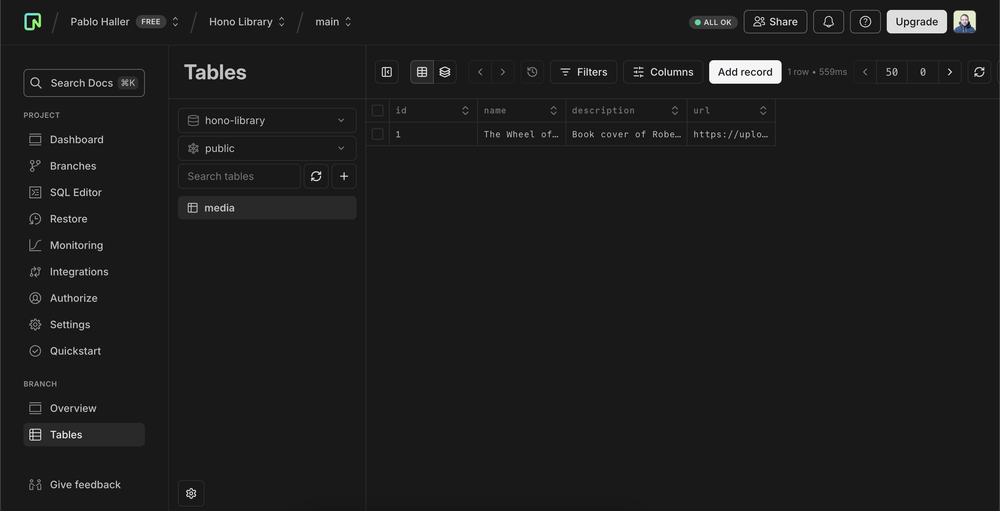

# Fast API Development with Hono and Cloudflare Workers

## Table of Contents

1. [Setup](#1-setup)
   - [Project Creation](#11-project-creation)
   - [Quick Connection Test](#12-quick-connection-test)
2. [Starting with Neon](#2-starting-with-neon)
   - [Configure Drizzle](#21-configure-drizzle)
   - [Work with Drizzle](#22-work-with-drizzle)
3. [Media Endpoint](#3-media-endpoint)
4. [Conclusion](#4-conclusion)

---

## 1. Setup

### 1.1 Project Creation

To start creating our API and quickly test it running in the cloud, follow these steps:

1. Run the necessary commands to initialize your project and select the correct template (`cloudflare-workers`). This setup enables an easy deployment process.

   

2. Once configured, you will have an app with an index file containing a basic "Hello World" example written in Hono, similar to Express.

   

3. Deploy your app by running `npm run deploy`. This opens an authorization form to create the Cloudflare Worker. Click "Allow" to proceed.

   

After successful deployment, you will see a confirmation message in your terminal. You can choose whether to share metrics (`Y` or `N`).

### 1.2 Quick Connection Test

Use the provided URL to test your API. If SSL certificates are not ready, use HTTP with tools like Postman or Insomnia.

   

To update your API, modify the `index.ts` file. For example, return a JSON response using the `json` function from the context object:

```typescript
app.get('/', (c) => c.json({ message: "Hello, JSON World!" }));
```

Run `npm run deploy` to apply changes.

---

## 2. Starting with Neon

### Configure Drizzle

1. Install the necessary dependencies:

   ```bash
   npm install drizzle-orm neon
   ```

2. Create a `db` folder with the following structure:

   - `schema.ts`: Define your database schema.
   - `client.ts`: Configure your database client.
   - `migrations.ts`: Handle database migrations.
   - `drizzle.config.ts`: Set up Drizzle configurations.

   Example of a simple schema:

   ```typescript
   import { table, varchar, integer } from "drizzle-orm";

   export const media = table("media", {
     id: integer("id").primaryKey(),
     name: varchar("name", { length: 255 }),
   });
   ```

3. Update `package.json` with these commands:

   ```json
   "scripts": {
     "generate": "drizzle-kit generate",
     "migrate": "drizzle-kit migrate"
   }
   ```

4. Run migration commands:

   ```bash
   npm run generate
   npm run migrate
   ```

### Work with Drizzle

Visit `https://local.drizzle.studio/` to interact with your database. Add and save records, then verify the data using the Neon console.

   

---

## 3. Media Endpoint

Add the following code to `index.ts` to create a `/media` endpoint:

```typescript
app.get('/media', async (c) => {
  const mediaData = await client.select().from(media);
  return c.json(mediaData);
});
```

Deploy the app to see the endpoint live.

---

## 4. Conclusion

In this guide, we explored how to:

- Use Hono for backend development.
- Configure and use Drizzle as an ORM.
- Set up a serverless Postgres database with Neon.
- Deploy APIs using Cloudflare Workers.

This setup enables fast API development and deployment. As a next step, try building a full CRUD application to enhance your skills!

---

For further reading, check the [Drizzle Documentation](https://orm.drizzle.team/docs/kit-overview) or the [Neon Setup Guide](https://neon.tech/blog/api-cf-drizzle-neon).
