# Fast API Development with Hono and Cloudflare workers

## 1. Setup

### 1.1. Project creation

To start creating our API and quickly test it running in the cloud, we'll need to run just a few commands.

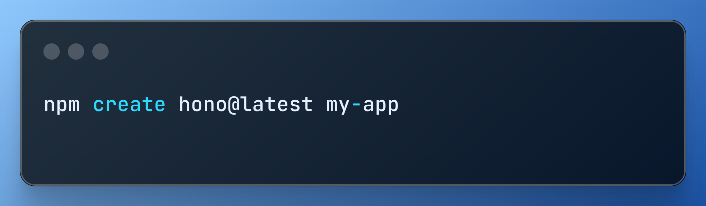

Once it's running, remember to select the correct template (cloudflare-workers) for the correct setup that will help us do an easy setup and fast deploy.

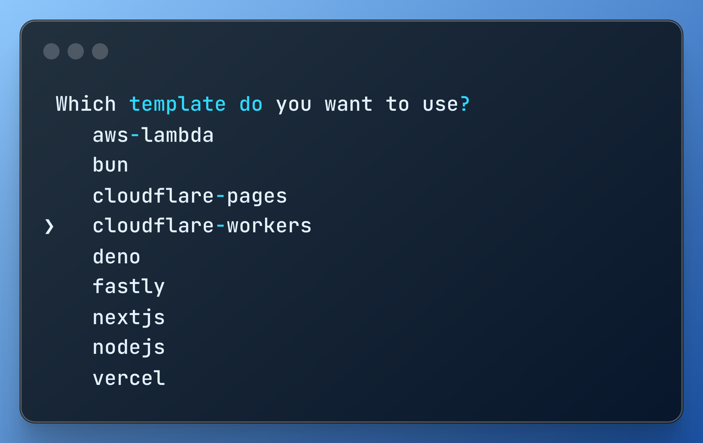

We'll get an app with many files, among them, an index with a classical "hello world", written in Hono, something very similar to Express.

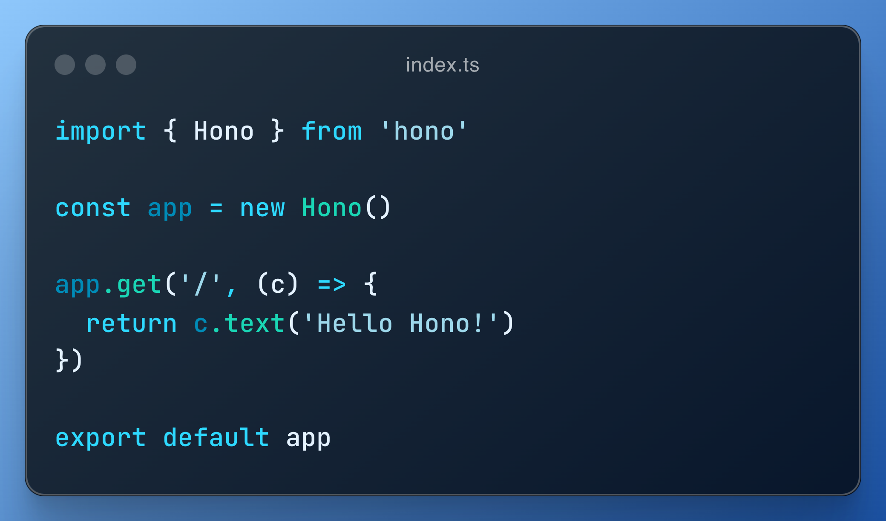

We're just a few steps of deploying our app. Can you believe it?

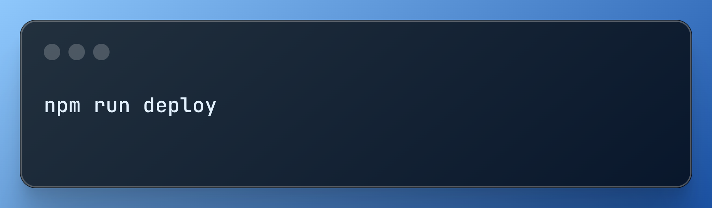

This will open a new tab for us to sign up. Fill the form, or use your preferred single sign on method.

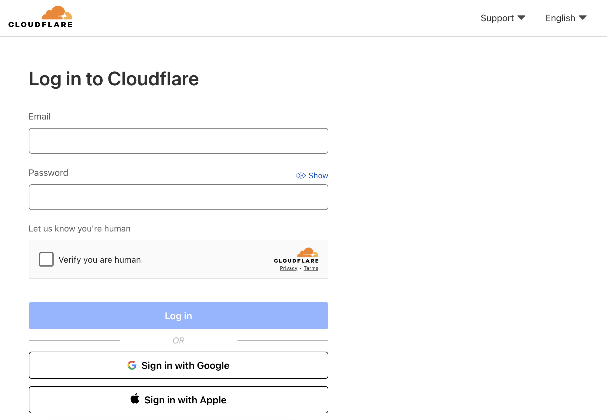

The sign up process is a bit slow; always wait for the dashboard to fully load. After that, in order to do a quick setup, just stop the running process in your terminal, and run `npm run deploy` again. This will open the following authorization form to create the Cloudflare Worker for us, so you just need to click on "Allow".

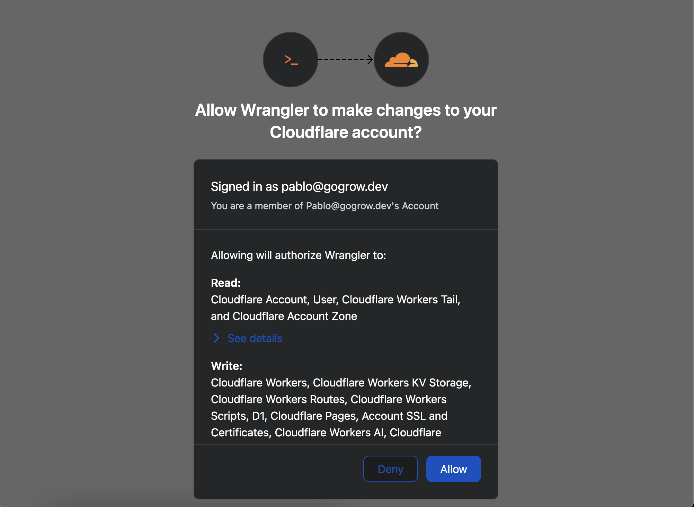

Once the process is finished, you'll get a successfully logged in message in your terminal. You'll be asked to share metrics or no, upon you to decide, pressing `Y` or `N`.

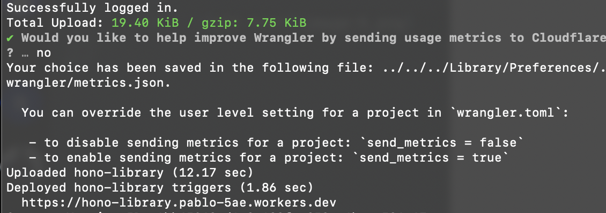

But this is pretty much what we need.

### 1.2. Quick connection test

Check the previous image; we have an interesting url there, ready to be hit. If you're not patient enough, you might get an error.

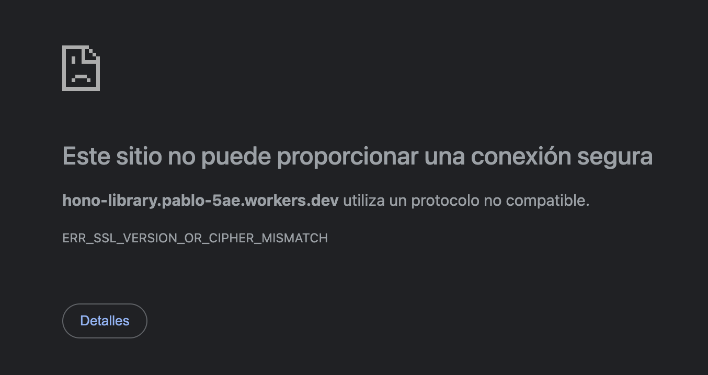

His is because our SSL certificates are not ready. But, we can still give it a try using HTTP, right? But, what do you think it is? Maybe an administration panel for our brand new API. Modern browsers might not allow us to do a plain HTTP request easily, so, we can try with Postman or Insomnia to at least, check what's going on.

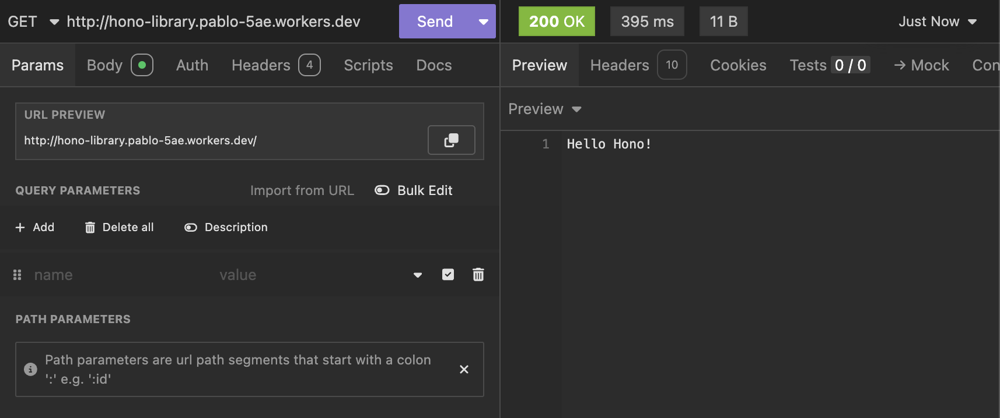

Remember that line? It's our API! Running live using Cloudflare Workers. In case you're skeptical of how easy it was all of this, let's make a small change on our index, making our function to return a JSON object instead of plain text using the `json` function provided by the context object (`c`):

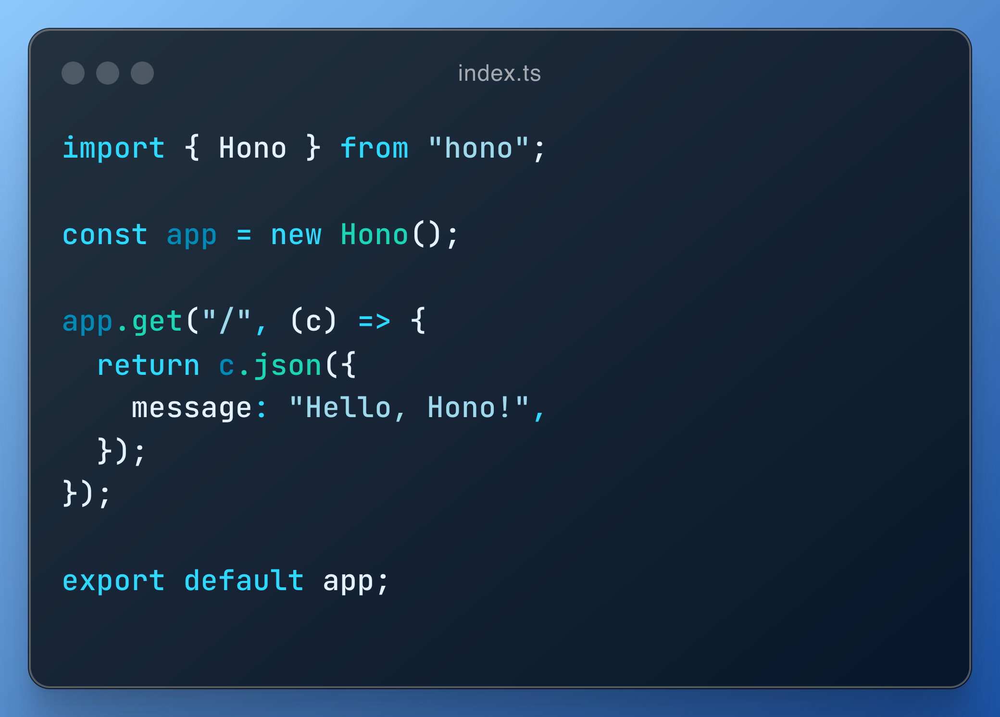

Save, and run `npm run deploy` in your terminal to see our changes live. Yes, it's that easy! And it took me only 3 seconds to deploy.

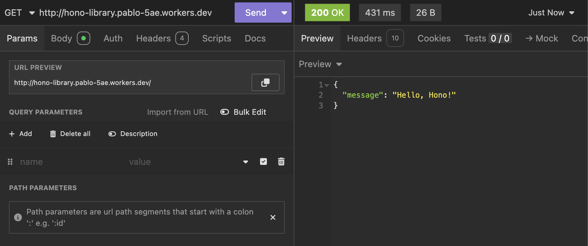

---

Second post?

## 2. Starting with Neon

In order to start working with your databases, first, we need to have one configured. Neon is a serverless provider that will be great to start. Go to `neon.tech` and sign-up with your preferred method. A project setup form will appear; fill it the following way:

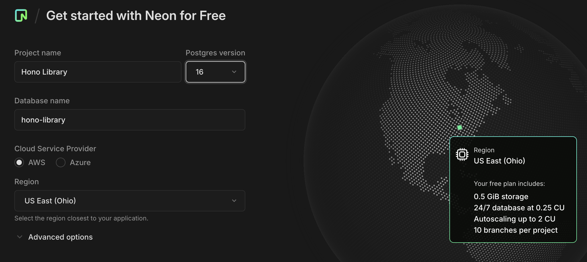

Click on `Confirm`.

Neon will ask for autoscaling, but we can just click on `Confirm` our `Use recommended` for our learning purposes.

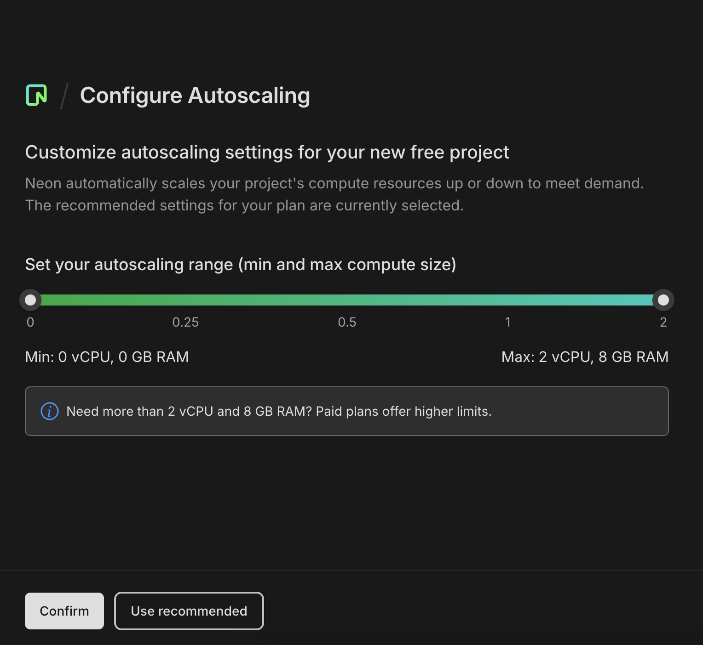

After that, finally, your quickstart panel will appear, where you can copy the postgres URL we need.

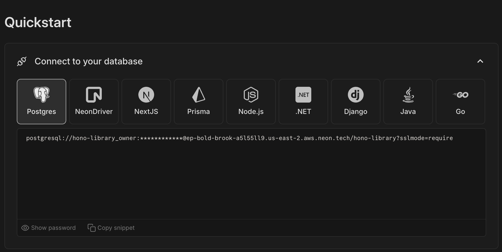

Once copied after pressing on `Copy snippet`, go to the `wrangler.toml` file in your Hono project. Uncomment the line `[vars]`, and add the `DATABASE_URL` environment variable.

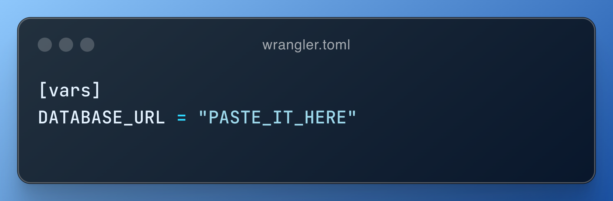

Weird not having an `.env` file, right? But this is how Hono and Cloudflare workers work. If you deploy again your app, it will set up with those variables. You could also do it through the settings panel in Cloudflare, but this is faster for development right now.
