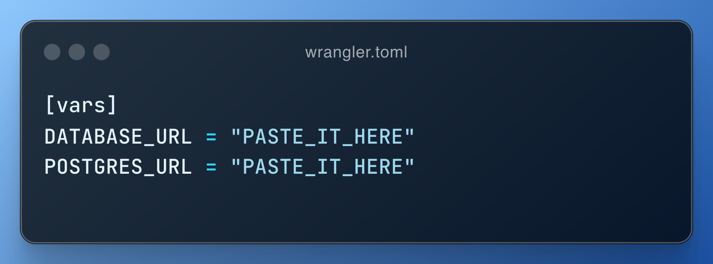

# Fast API Development with Hono and Cloudflare Workers

## Introduction

For the past few weeks, I've been looking for the right tools to develop REST APIs quickly and deploy them with minimal effort. That's when I came across **Hono**. At first, I didn’t think much of it, but after giving it a try, I really liked how similar it is to Express. It felt familiar and easy to work with.

However, I soon realized that Hono isn't designed for traditional Node.js projects. It's built specifically for **Cloudflare Workers**. That got me thinking: _what exactly are Cloudflare Workers?_ I decided to explore the platform to understand how it works and see if it was the right fit for my needs.

I have to say, Cloudflare Workers surprised me, in a good way. They were so easy to set up and use that I decided to push myself further by experimenting with **Drizzle ORM**, one of my many pending To-Do's. I briefly encountered Drizzle before when setting up an AI Chatbot with a [Vercel template](https://vercel.com/templates/next.js/nextjs-ai-chatbot), but this time, I wanted to really dig in and try it from scratch.

The result? A combination of:

- [Hono](https://hono.dev/) — a lightweight web application framework.
- [Drizzle](https://orm.drizzle.team/) — a TypeScript ORM.
- [Cloudflare Workers](https://workers.cloudflare.com/) — a platform for serverless code deployment.
- [Neon](https://neon.tech) — a serverless platform to create and manage Postgres databases.

Here’s what I learned and how everything came together.

## 1. Setup

### 1.1. Project creation

To start creating our API and quickly test it running in the cloud, we'll need to run just a few commands.

Once it's running, remember to select the correct template (cloudflare-workers) for the correct setup that will help us do an easy setup and fast deploy.

We'll get an app with many files, among them, an index with a classical "hello world", written in Hono, something very similar to Express.

We're just a few steps of deploying our app. Can you believe it?

This will open a new tab for us to sign up. Fill the form, or use your preferred single sign on method.

The sign up process is a bit slow; always wait for the dashboard to fully load. After that, in order to do a quick setup, just stop the running process in your terminal, and run `npm run deploy` again. This will open the following authorization form to create the Cloudflare Worker for us, so you just need to click on "Allow".

Once the process is finished, you'll get a successfully logged in message in your terminal. You'll be asked to share metrics or no, upon you to decide, pressing `Y` or `N`.

But this is pretty much what we need.

### 1.2. Quick connection test

Check the previous image; we have an interesting url there, ready to be hit. If you're not patient enough, you might get an error.

His is because our SSL certificates are not ready. But, we can still give it a try using HTTP, right? But, what do you think it is? Maybe an administration panel for our brand new API. Modern browsers might not allow us to do a plain HTTP request easily, so, we can try with Postman or Insomnia to at least, check what's going on.

Remember that line? It's our API! Running live using Cloudflare Workers. In case you're skeptical of how easy it was all of this, let's make a small change on our index, making our function to return a JSON object instead of plain text using the `json` function provided by the context object (`c`):

Save, and run `npm run deploy` in your terminal to see our changes live. Yes, it's that easy! And it took me only 3 seconds to deploy.

---

Second post?

## 2. Starting with Neon

In order to start working with your databases, first, we need to have one configured. Neon is a serverless provider that will be great to start. Go to `neon.tech` and sign-up with your preferred method. A project setup form will appear; fill it the following way:

Click on `Confirm`.

Neon will ask for autoscaling, but we can just click on `Confirm` our `Use recommended` for our learning purposes.

After that, finally, your quickstart panel will appear, where you can copy the postgres URL we need.

Once copied after pressing on `Copy snippet`, go to the `wrangler.toml` file in your Hono project. Uncomment the line `[vars]`, and add the `DATABASE_URL` environment variable.

Weird not having an `.env` file, right? We will still need it, don't worry. Create it too.

But this is how Hono and Cloudflare Workers work. If you deploy again your app, it will set up with those variables. You could also do it through the settings panel in Cloudflare, but this is faster for development right now.

### 2.1. Configure Drizzle

Now, we need to start configuring drizzle. Run the following commands to install all the needed dependencies:

Now, we'll need four different files to make this work according to Neon's setup page, which you can find [here](https://neon.tech/blog/api-cf-drizzle-neon).

At the root of your project, create `db` folder, containing the following files:

First, let's create our schema, describing a small table which wil contain simple fields to recognize and locate media:

Then, our client to open connections and operate with our database, which we'll need to use for our requests.

We'll need to perform migrations at some point, and we'll also need an specific function.

We're almost done configuring Drizzle; the `drizzle.config.ts` file it's really important, containing all the required settings to make drizzle work properly.

As you can see, the created folders and files are mentioned all across the different code we've added.

Now, the last modification we have to do is adding some commands to our `package.json`, and we should be ready to go. You might not need all of these, but, they might be handy to remember.

### 2.2. Work with Drizzle

Now, we have everything set up to have out database working. Run the following commands in order:

In order, `generate` will create a migration file based on the types/objects in the `schema.ts` file. The `migration` command will update the schema with any pending migrations and push them to Neon.

You can learn about all this commands [here](https://orm.drizzle.team/docs/kit-overview).

Now, let's start working a bit with our data.

If you access `https://local.drizzle.studio/`, you'll see the following screen.

You can click on `Add Record`, and a row will display to add a new entry. Fill them as you see convenient, but remember to hit enter on every field to save the current draft state.

Hit on `Save 1 Change`, and wait for your record to be saved.

Now, we can try to check if the data was actually uploaded to the cloud. Go to `https://console.neon.tech/`, and click on your project (in this case, `Hono Library`)

Once there, in the left side menu, look for the `Tables` option. Click on it, and if everything went well, you'll se your data being displayed in the cloud!

## 3. Media endpoint

Now, as we're learning basic, let's not focus on different configurations and folder structures to make this look pretty. Let's just make it work, following the setup guide from Neon.

In your `index.ts` file, add the following code:

Here, we're creating a get request. The endpoint will be `/media`. We get the environment variable for our database url (`POSTGRES_URL` or `DATABASE_URL`) using the `env` function from `hono/adapter`. This is the standard way in Hono to retrieve such variables defined in our `wrangler.toml` file at runtime.

Then, we get the `client` we created previously, running a select statement from the `media` table imported from the `schema` file. Last step is returning/rendering a JSON (object or array) using the function provided by context as we did before.

The only thing you need to do now is run your deploy command, wait for it to success, and everything should be done. You should be able to see a JSON response from your Cloudflare Worker!

## Conclusion

So far, we've explored several exciting technologies that can help you develop a REST API faster and deploy it in seconds.

But there's still plenty more to try! Consider this a starting point to dive deeper into what we’ve covered.

You can create new tables with Drizzle, relate and migrate them to the cloud, and then build the necessary endpoints with Hono to perform create, read, update, and delete operations. Finally, deploy everything using Cloudflare Workers to see your changes live in seconds.

If you're in trouble, here are some helpful links that guided me through this journey, and they might be useful to you as well.

- Hono's Cloudflare Workers, [https://hono.dev/docs/getting-started/cloudflare-workers](https://hono.dev/docs/getting-started/cloudflare-workers).
- Hono's Getting Started, [https://hono.dev/docs/getting-started/basic](https://hono.dev/docs/getting-started/basic).
- Neon's Build a serverless API using Cloudflare Workers, Drizzle ORM, and Neon, [https://neon.tech/blog/api-cf-drizzle-neon](https://neon.tech/blog/api-cf-drizzle-neon).
- Drizzle's Drizzle <> Neon Postgres, [https://orm.drizzle.team/docs/connect-neon](https://orm.drizzle.team/docs/connect-neon).
- Migrations with drizzle-kit, [https://orm.drizzle.team/docs/kit-overview](https://orm.drizzle.team/docs/kit-overview).
- Drizzle's basic select, [https://orm.drizzle.team/docs/select#basic-select](https://orm.drizzle.team/docs/select#basic-select).
- Vercel's Next.js AI Chatbot, [https://vercel.com/templates/next.js/nextjs-ai-chatbot](https://vercel.com/templates/next.js/nextjs-ai-chatbot).

And the link to the repository with all this code:
